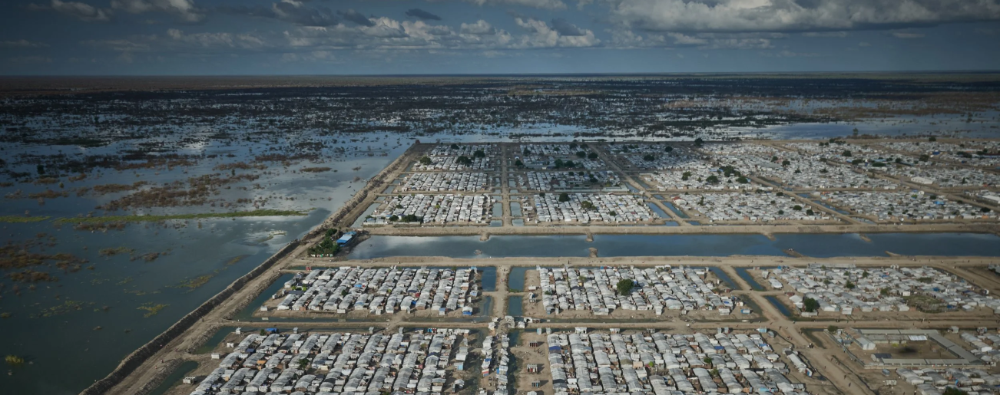
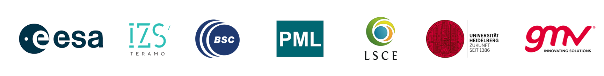

# Climate–Health Adaptation through New Generation Earth observations

This organization brings together all the case studies developed under the **CHANGE project**, funded by the **European Space Agency (ESA)**. Each repository contains all the code and analytical workflows developed for each case study.

  

# Project Description

Climate–Health adaptation through New Generation Earth observations (CHANGE) is an ESA-funded project led by GMVIt aims to integrate Earth Observation (EO) data —building on the work of the ESA **Climate Change Initiative (CCI)**— into climate-health research to strengthen the resilience of vulnerable regional and local health systems.

By addressing hazards such as extreme rainfall, floods, droughts, heatwaves, wildfires, and ENSO-driven events, the project seeks to quantify the health burden attributable to climate change. Six regional use cases in countries including the UK, South Sudan, Sudan, Sri Lanka, and Brazil will guide the analysis. The resulting Climate and Health Adaptation Roadmap provides evidence to inform targeted adaptation and mitigation policies

# About

The present project has been led by GMV in collaboration with the Barcelona Supercomputing Center, Plymouth Marine Laboratory, Universität Heidelberg, Istituto Zooprofilattico Sperimentale (IZSAM), and the Laboratory for Climate and Environmental Sciences (LSCE).

